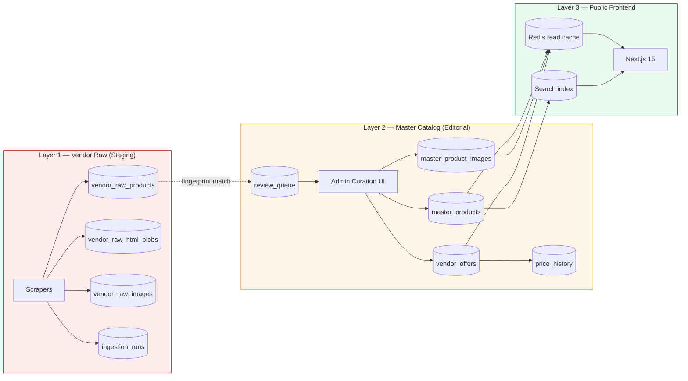
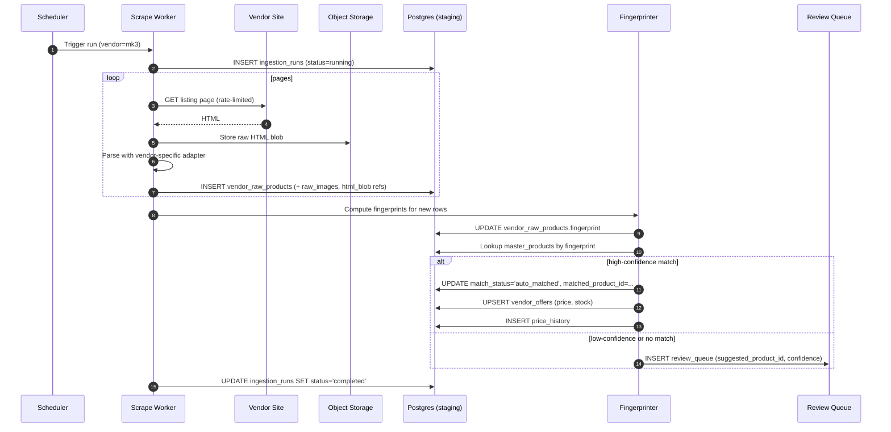
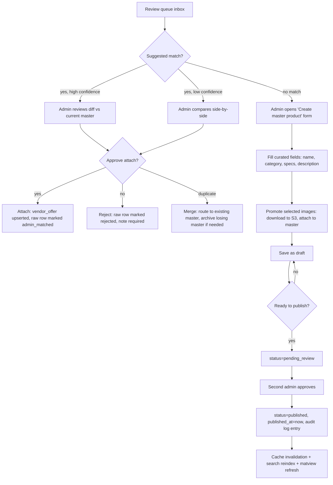
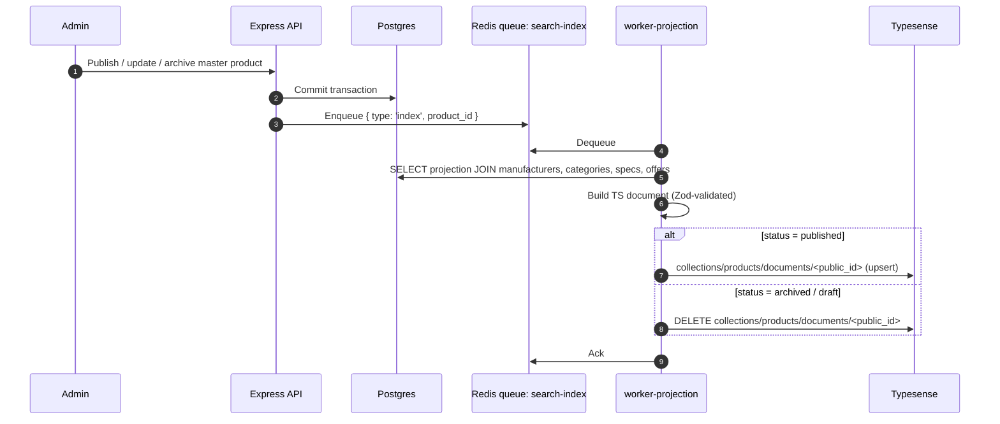
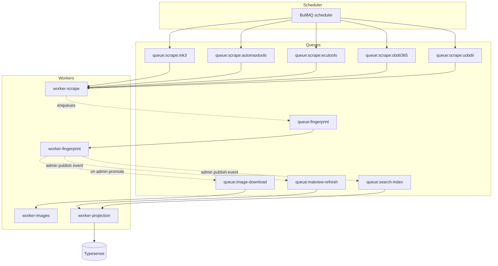
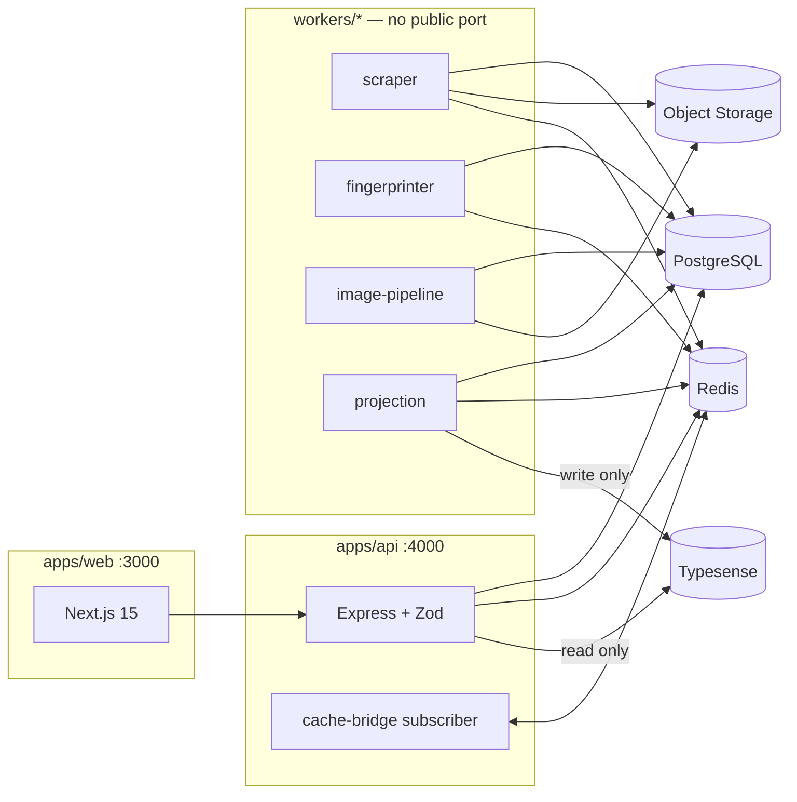
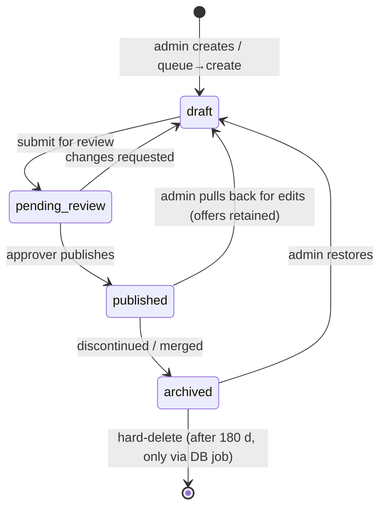
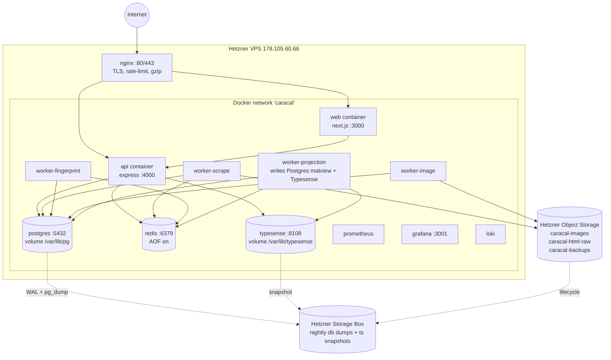

# Caracal Tech Motors — Master Catalog Architecture

Version: 1.1 — Final design
Status: Proposal, awaiting approval
Author: Lead Architect
Stack: Next.js 15 • Express • Prisma • PostgreSQL • Redis • Typesense • Docker • Nginx • pnpm monorepo
Target VPS: Hetzner, `178.105.60.66`

> **Authoritative rules** (every later section must respect these)
> 1. PostgreSQL is the source of truth. Typesense, Redis, and the public matview are derived.
> 2. Typesense is a search index only — never a write target, never read for non-search needs.
> 3. Vendor data lands in staging tables only. Frontend never queries staging.
> 4. Admin manually maps products, sets prices, and publishes. No auto-publish.
> 5. The public site shows only curated, published master products.
> 6. Vendor HTML is never rendered. Descriptions are Caracal-authored markdown.
> 7. Scrapers cannot overwrite curated products — they cannot write to `master_*` tables at all.

---

## Table of Contents

1. Executive Summary
2. Current State Analysis
3. Why the Inventory Became Corrupted
4. Architectural Principles
5. The Three-Layer Model
6. PostgreSQL Schema
7. Vendor Ingestion & Staging Flow
8. Admin Curation Workflow
9. Product Mapping & Anti-Duplication
10. Image Ownership Strategy
11. Search & Filter Architecture
12. Scraper Scheduling Architecture
13. Redis Cache Strategy
14. API Structure
15. Folder Structure (Monorepo)
16. Worker / Service Separation
17. Product Lifecycle (State Machine)
18. Deployment Topology
19. Backup Strategy
20. Monitoring & Logging
21. Runtime Validation Strategy
22. Safe Synchronization Strategy
23. Migration Strategy from Corrupted Inventory
24. Open Risks & Future Considerations

---

## 1. Executive Summary

Caracal Tech Motors is **not** a generic ecommerce store. It is a **curated tuning-tools intelligence marketplace**. The catalog is a content product — every published item is reviewed, mapped, enriched, and owned by Caracal. Vendor prices from `mk3.com`, `automaxtools.me`, `ecutools.eu`, `obdii365.com`, and `uobdii.com` are *inputs*, not outputs.

The current system collapsed because vendor data, legacy imports, and the public catalog were never separated. The redesign enforces a strict three-layer architecture:

- **Layer 1 — Vendor Raw**: append-only staging of everything we scrape. Never read by the frontend.
- **Layer 2 — Master Catalog**: admin-curated canonical products. Each public product lives here and only here.
- **Layer 3 — Public Frontend**: reads a cached, validated, projection of Layer 2.

Vendor offers attach *to* master products as side data (price, availability, source URL). They cannot create, mutate, or delete a master product. Scrapers can only insert into staging.

---

## 2. Current State Analysis

What the existing system did wrong, by component:

| Area | Current behavior | Consequence |
|---|---|---|
| Tables | Vendor scrapes, legacy import, and "products" live in the same table(s) | No way to tell what is canonical |
| Writes | Scrapers `UPSERT` into the live products table | Scrapers can silently rewrite the catalog at any time |
| Frontend | Queries the same table scrapers write to | A bad scrape can corrupt the storefront immediately |
| Images | Hot-linked from vendor CDNs | Breaks when vendors rename, rotate, or block hotlinking |
| Dedup | None — same product appears 3–5× under different vendor SKUs | Duplicate listings inflated to 10,452 |
| Pricing | Vendor price treated as product price | One product = one vendor, not "best of N vendors" |
| Audit | No record of where a field came from | Cannot diff or roll back |
| Ownership | Implicit — last write wins | No editorial control |

Result: 10,452 rows of mixed-provenance data, none of it safe to publish, none of it deletable without breaking something downstream.

---

## 3. Why the Inventory Became Corrupted

Five compounding root causes:

1. **No staging boundary.** Scrapers were given write access to the same table the storefront reads from. Every scrape run was a live deployment of unreviewed data.
2. **No canonical product entity.** "A product" was whatever the most recent import said it was. There was no `master_product` distinct from a "vendor listing."
3. **Identity by URL.** Products were keyed by vendor URL or scraped SKU, so the same KESS V3 from mk3 and from ecutools became two separate products.
4. **Coupled writes.** Legacy import pushed 10k rows in one go using the same upsert path scrapers used, so legacy rows and scraper rows became indistinguishable afterwards.
5. **No editorial workflow.** No state machine, no review queue, no `published` flag, no audit log. Admin had no way to say "this row is correct, freeze it."

The fix is structural — adding validation to the current schema will not resolve it. The data model itself encodes the corruption.

---

## 4. Architectural Principles

These are the non-negotiable rules the system is built around. Every later design decision derives from them.

1. **Vendor data is input, never output.** Scrapers write to `vendor_raw_*` tables only. The public catalog never queries these tables.
2. **The master catalog is editorial.** A `master_product` exists because a human approved it. It is the only source of truth for the frontend.
3. **One canonical product, many vendor offers.** Each `master_product` can have N `vendor_offer` rows attached. Frontend shows the best offer; admin controls which offers are visible.
4. **Append-only ingestion.** Raw scrapes are never updated in place — each scrape is a new `ingestion_run` with new rows. History is preserved.
5. **Explicit lifecycle.** Every product is in exactly one state: `draft`, `pending_review`, `published`, `archived`. Transitions are logged.
6. **Local image ownership.** All published images are stored on Caracal infrastructure (Hetzner Object Storage). Vendor image URLs live only in staging.
7. **Schema-validated at the edge.** Every cross-boundary payload — scraper output, admin form, public API response — is validated by a Zod schema. No untyped JSON crosses a service boundary.
8. **Read paths are cached, write paths are not.** Public reads go through Redis. Admin writes hit Postgres directly and invalidate.
9. **Workers are separate from the API.** Scrapers, ingestion parsers, image downloaders, and search indexers run in a dedicated worker process. The API never blocks on background work.
10. **No destructive operation is silent.** Archive instead of delete. Soft-delete with `deleted_at`. Audit every admin write.

---

## 5. The Three-Layer Model



**Direction of allowed flow** (and only this direction):

- L1 → L2 only through the **review queue**, only by admin action.
- L2 → L3 only through **cache invalidation + projection**.
- L3 never writes upward except via authenticated admin endpoints.
- L1 never reads from L2 or L3. Scrapers know nothing about the catalog.

---

## 6. PostgreSQL Schema

Schema is split by concern. Tables are grouped here by layer.

### 6.1 Core reference tables

```sql
CREATE TABLE manufacturers (
    id              BIGSERIAL PRIMARY KEY,
    slug            CITEXT UNIQUE NOT NULL,            -- 'kess', 'autel', 'launch'
    name            TEXT NOT NULL,
    website         TEXT,
    logo_image_id   BIGINT REFERENCES master_product_images(id),
    created_at      TIMESTAMPTZ NOT NULL DEFAULT now(),
    updated_at      TIMESTAMPTZ NOT NULL DEFAULT now()
);

CREATE TABLE categories (
    id              BIGSERIAL PRIMARY KEY,
    parent_id       BIGINT REFERENCES categories(id),
    slug            CITEXT NOT NULL,
    name            TEXT NOT NULL,
    description     TEXT,
    sort_order      INT DEFAULT 0,
    UNIQUE (parent_id, slug)
);

CREATE TABLE vendors (
    id              BIGSERIAL PRIMARY KEY,
    slug            CITEXT UNIQUE NOT NULL,            -- 'mk3', 'automaxtools', 'ecutools', 'obdii365', 'uobdii'
    name            TEXT NOT NULL,
    base_url        TEXT NOT NULL,
    enabled         BOOLEAN NOT NULL DEFAULT true,
    scrape_cadence  INTERVAL NOT NULL DEFAULT INTERVAL '24 hours',
    last_scraped_at TIMESTAMPTZ,
    notes           TEXT
);

CREATE TABLE tags (
    id              BIGSERIAL PRIMARY KEY,
    slug            CITEXT UNIQUE NOT NULL,
    name            TEXT NOT NULL
);
```

### 6.2 Master catalog (Layer 2 — the curated truth)

```sql
CREATE TYPE product_status AS ENUM ('draft', 'pending_review', 'published', 'archived');

CREATE TABLE master_products (
    id              BIGSERIAL PRIMARY KEY,
    public_id       UUID NOT NULL UNIQUE DEFAULT gen_random_uuid(),  -- never expose internal id
    slug            CITEXT UNIQUE NOT NULL,                          -- '/products/kess-v3-master'
    sku             CITEXT UNIQUE,                                   -- Caracal-assigned SKU
    mpn             CITEXT,                                          -- manufacturer part number
    name            TEXT NOT NULL,
    short_description TEXT,
    long_description_md TEXT,                                        -- markdown, never raw HTML
    manufacturer_id BIGINT NOT NULL REFERENCES manufacturers(id),
    category_id     BIGINT NOT NULL REFERENCES categories(id),
    status          product_status NOT NULL DEFAULT 'draft',
    fingerprint     TEXT NOT NULL,                                   -- see §9
    featured        BOOLEAN NOT NULL DEFAULT false,
    seo_title       TEXT,
    seo_description TEXT,
    created_by      BIGINT NOT NULL REFERENCES users(id),
    updated_by      BIGINT NOT NULL REFERENCES users(id),
    published_at    TIMESTAMPTZ,
    archived_at     TIMESTAMPTZ,
    created_at      TIMESTAMPTZ NOT NULL DEFAULT now(),
    updated_at      TIMESTAMPTZ NOT NULL DEFAULT now()
);

CREATE INDEX master_products_status_idx ON master_products(status) WHERE status = 'published';
CREATE INDEX master_products_category_idx ON master_products(category_id);
CREATE INDEX master_products_manufacturer_idx ON master_products(manufacturer_id);
CREATE INDEX master_products_fingerprint_idx ON master_products(fingerprint);

CREATE TABLE master_product_specs (
    id              BIGSERIAL PRIMARY KEY,
    product_id      BIGINT NOT NULL REFERENCES master_products(id) ON DELETE CASCADE,
    key             CITEXT NOT NULL,                                 -- 'supported_protocols', 'voltage'
    value           TEXT NOT NULL,
    unit            TEXT,
    sort_order      INT DEFAULT 0,
    UNIQUE (product_id, key)
);

CREATE TABLE master_product_images (
    id              BIGSERIAL PRIMARY KEY,
    product_id      BIGINT NOT NULL REFERENCES master_products(id) ON DELETE CASCADE,
    storage_key     TEXT NOT NULL,                                   -- 's3://caracal-images/abc.webp'
    width           INT,
    height          INT,
    mime_type       TEXT,
    alt_text        TEXT,
    is_primary      BOOLEAN NOT NULL DEFAULT false,
    sort_order      INT DEFAULT 0,
    source_vendor_id BIGINT REFERENCES vendors(id),                  -- audit trail only
    created_at      TIMESTAMPTZ NOT NULL DEFAULT now()
);

CREATE UNIQUE INDEX master_product_one_primary_image
    ON master_product_images(product_id) WHERE is_primary;

CREATE TABLE master_product_tags (
    product_id      BIGINT REFERENCES master_products(id) ON DELETE CASCADE,
    tag_id          BIGINT REFERENCES tags(id) ON DELETE CASCADE,
    PRIMARY KEY (product_id, tag_id)
);

CREATE TABLE master_product_compatibility (
    id              BIGSERIAL PRIMARY KEY,
    product_id      BIGINT NOT NULL REFERENCES master_products(id) ON DELETE CASCADE,
    make            TEXT,
    model           TEXT,
    year_from       INT,
    year_to         INT,
    ecu             TEXT,
    notes           TEXT
);
```

### 6.3 Vendor offers (Layer 2 — vendor side of the curated truth)

```sql
CREATE TYPE offer_status AS ENUM ('active', 'paused', 'discontinued');

CREATE TABLE vendor_offers (
    id              BIGSERIAL PRIMARY KEY,
    product_id      BIGINT NOT NULL REFERENCES master_products(id) ON DELETE CASCADE,
    vendor_id       BIGINT NOT NULL REFERENCES vendors(id),
    vendor_sku      TEXT,
    vendor_url      TEXT NOT NULL,
    price_cents     BIGINT,                                          -- always in minor units
    currency        CHAR(3) NOT NULL DEFAULT 'USD',
    in_stock        BOOLEAN,
    last_seen_at    TIMESTAMPTZ NOT NULL,
    status          offer_status NOT NULL DEFAULT 'active',
    confidence      NUMERIC(3,2) NOT NULL DEFAULT 1.00,              -- mapping confidence
    notes           TEXT,
    created_at      TIMESTAMPTZ NOT NULL DEFAULT now(),
    updated_at      TIMESTAMPTZ NOT NULL DEFAULT now(),
    UNIQUE (vendor_id, vendor_url)
);

CREATE INDEX vendor_offers_product_idx ON vendor_offers(product_id);

CREATE TABLE price_history (
    id              BIGSERIAL PRIMARY KEY,
    offer_id        BIGINT NOT NULL REFERENCES vendor_offers(id) ON DELETE CASCADE,
    price_cents     BIGINT NOT NULL,
    currency        CHAR(3) NOT NULL,
    in_stock        BOOLEAN,
    observed_at     TIMESTAMPTZ NOT NULL DEFAULT now()
);

CREATE INDEX price_history_offer_time_idx ON price_history(offer_id, observed_at DESC);
```

### 6.4 Vendor raw / staging (Layer 1 — never read by frontend)

```sql
CREATE TYPE ingestion_status AS ENUM ('running', 'completed', 'failed', 'partial');
CREATE TYPE raw_match_status AS ENUM ('unmatched', 'auto_matched', 'admin_matched', 'rejected');

CREATE TABLE ingestion_runs (
    id              BIGSERIAL PRIMARY KEY,
    vendor_id       BIGINT NOT NULL REFERENCES vendors(id),
    started_at      TIMESTAMPTZ NOT NULL DEFAULT now(),
    finished_at     TIMESTAMPTZ,
    status          ingestion_status NOT NULL DEFAULT 'running',
    pages_scraped   INT DEFAULT 0,
    products_found  INT DEFAULT 0,
    errors          JSONB DEFAULT '[]'::jsonb,
    triggered_by    TEXT NOT NULL                                    -- 'schedule', 'manual:userId=...'
);

CREATE TABLE vendor_raw_products (
    id              BIGSERIAL PRIMARY KEY,
    ingestion_run_id BIGINT NOT NULL REFERENCES ingestion_runs(id),
    vendor_id       BIGINT NOT NULL REFERENCES vendors(id),
    vendor_url      TEXT NOT NULL,
    vendor_sku      TEXT,
    raw_name        TEXT,
    raw_description TEXT,
    raw_price_text  TEXT,
    parsed_price_cents BIGINT,
    parsed_currency CHAR(3),
    parsed_in_stock BOOLEAN,
    raw_specs       JSONB,
    raw_image_urls  TEXT[],
    fingerprint     TEXT NOT NULL,                                   -- see §9
    matched_product_id BIGINT REFERENCES master_products(id),
    match_status    raw_match_status NOT NULL DEFAULT 'unmatched',
    match_confidence NUMERIC(3,2),
    scraped_at      TIMESTAMPTZ NOT NULL DEFAULT now()
);

CREATE INDEX vendor_raw_products_run_idx     ON vendor_raw_products(ingestion_run_id);
CREATE INDEX vendor_raw_products_fp_idx      ON vendor_raw_products(fingerprint);
CREATE INDEX vendor_raw_products_match_idx   ON vendor_raw_products(match_status);
CREATE UNIQUE INDEX vendor_raw_url_per_run   ON vendor_raw_products(ingestion_run_id, vendor_id, vendor_url);

-- Raw HTML kept for forensics; not loaded by API
CREATE TABLE vendor_raw_html_blobs (
    id              BIGSERIAL PRIMARY KEY,
    raw_product_id  BIGINT NOT NULL REFERENCES vendor_raw_products(id) ON DELETE CASCADE,
    html_storage_key TEXT NOT NULL,                                  -- object storage path
    bytes           INT,
    captured_at     TIMESTAMPTZ NOT NULL DEFAULT now()
);

-- Vendor images held in staging until admin chooses to promote them
CREATE TABLE vendor_raw_images (
    id              BIGSERIAL PRIMARY KEY,
    raw_product_id  BIGINT NOT NULL REFERENCES vendor_raw_products(id) ON DELETE CASCADE,
    original_url    TEXT NOT NULL,
    storage_key     TEXT,                                            -- downloaded copy
    bytes           INT,
    width           INT,
    height          INT,
    downloaded_at   TIMESTAMPTZ
);
```

### 6.5 Review queue, users, audit

```sql
CREATE TYPE review_action AS ENUM ('create_master', 'attach_to_master', 'reject', 'duplicate');

CREATE TABLE review_queue (
    id              BIGSERIAL PRIMARY KEY,
    raw_product_id  BIGINT NOT NULL UNIQUE REFERENCES vendor_raw_products(id) ON DELETE CASCADE,
    suggested_product_id BIGINT REFERENCES master_products(id),
    suggested_confidence NUMERIC(3,2),
    priority        INT NOT NULL DEFAULT 100,
    assigned_to     BIGINT REFERENCES users(id),
    resolved_at     TIMESTAMPTZ,
    resolved_by     BIGINT REFERENCES users(id),
    resolved_action review_action,
    notes           TEXT,
    created_at      TIMESTAMPTZ NOT NULL DEFAULT now()
);

CREATE INDEX review_queue_open_idx ON review_queue(priority, created_at) WHERE resolved_at IS NULL;

CREATE TABLE users (
    id              BIGSERIAL PRIMARY KEY,
    email           CITEXT UNIQUE NOT NULL,
    password_hash   TEXT NOT NULL,
    role            TEXT NOT NULL DEFAULT 'admin',                   -- 'admin', 'curator', 'viewer'
    name            TEXT,
    active          BOOLEAN NOT NULL DEFAULT true,
    created_at      TIMESTAMPTZ NOT NULL DEFAULT now()
);

CREATE TABLE admin_audit_log (
    id              BIGSERIAL PRIMARY KEY,
    user_id         BIGINT NOT NULL REFERENCES users(id),
    entity_type     TEXT NOT NULL,                                   -- 'master_product', 'vendor_offer'
    entity_id       BIGINT NOT NULL,
    action          TEXT NOT NULL,                                   -- 'create','update','publish','archive'
    diff            JSONB,
    request_id      TEXT,
    occurred_at     TIMESTAMPTZ NOT NULL DEFAULT now()
);

CREATE INDEX audit_entity_idx ON admin_audit_log(entity_type, entity_id, occurred_at DESC);
```

### 6.6 Public projection (materialized, refreshed on invalidation)

```sql
-- Read-optimized view consumed by the API for public listings.
-- Refreshed on master_product / vendor_offer change.
CREATE MATERIALIZED VIEW public_products AS
SELECT
    mp.public_id,
    mp.slug,
    mp.name,
    mp.short_description,
    mp.long_description_md,
    m.slug   AS manufacturer_slug,
    m.name   AS manufacturer_name,
    c.slug   AS category_slug,
    c.name   AS category_name,
    (
      SELECT json_build_object('storage_key', i.storage_key, 'alt_text', i.alt_text)
      FROM master_product_images i
      WHERE i.product_id = mp.id AND i.is_primary
      LIMIT 1
    ) AS primary_image,
    (
      SELECT MIN(price_cents) FROM vendor_offers vo
      WHERE vo.product_id = mp.id AND vo.status = 'active' AND vo.in_stock = true
    ) AS best_price_cents,
    (
      SELECT COUNT(*) FROM vendor_offers vo
      WHERE vo.product_id = mp.id AND vo.status = 'active'
    ) AS offer_count,
    mp.published_at
FROM master_products mp
JOIN manufacturers m ON m.id = mp.manufacturer_id
JOIN categories    c ON c.id = mp.category_id
WHERE mp.status = 'published';

CREATE UNIQUE INDEX public_products_slug_idx ON public_products(slug);
CREATE INDEX        public_products_category_idx ON public_products(category_slug);
```

---

## 7. Vendor Ingestion & Staging Flow



Key rules:

- Each scrape is one `ingestion_runs` row. All raw rows reference it. Rolling back a bad scrape = filtering by run id.
- A scraped row never overwrites a master product. It either feeds an offer update or sits in the queue.
- Vendor images stay in `vendor_raw_images` until an admin promotes them.
- HTML blobs go to object storage, not Postgres. The DB references the storage key.

---

## 8. Admin Curation Workflow



Curation principles:

- **Two-person publish** for new master products (creator ≠ publisher). Updates to already-published products can be single-admin.
- **Image promotion is explicit.** Admin selects which raw vendor images to download into the master catalog. Caracal owns the local copy thereafter.
- **Description rewrite is the norm.** The vendor's marketing copy is never published. Admin writes (or paraphrases via a curation tool) a Caracal description in markdown.
- **Every state change goes to `admin_audit_log`** with a JSON diff.

---

## 9. Product Mapping & Anti-Duplication

The biggest cause of the 10,452 mess was treating vendor URL as identity. The redesign separates *identity* from *source*.

### 9.1 Fingerprint definition

A `fingerprint` is a deterministic, normalized hash designed to collide when two listings refer to the same physical product. Computed as:

```
fingerprint = sha1(
  normalize(manufacturer_slug) || '|' ||
  normalize(mpn_or_model_number) || '|' ||
  normalize(variant_key)
)
```

Where:
- `normalize` = lowercase, strip diacritics, strip punctuation, collapse whitespace, drop common stopwords (`kit`, `full`, `pcs`, `set`).
- `mpn_or_model_number` is extracted by a per-vendor adapter (`KESS V3 Master`, `KTM200`, etc.).
- `variant_key` distinguishes Master vs Slave, EU vs US plug, OBD vs Bench, etc. It comes from a fixed enum of variant axes, not free text.

Fingerprints are stored on both `master_products` and `vendor_raw_products`. The match query is a B-tree lookup.

### 9.2 Match confidence tiers

| Tier | Criterion | Action |
|---|---|---|
| 1.00 | Exact fingerprint hit | `auto_matched`, offer upserted |
| 0.80 | Fingerprint differs only in `variant_key` | Suggested in review queue |
| 0.60 | Manufacturer + fuzzy name (trigram > 0.7) | Suggested in review queue |
| < 0.60 | No good match | Queue for new-product creation |

### 9.3 Anti-duplication rules

- `master_products.fingerprint` has a partial unique index on `WHERE status != 'archived'`. Two live masters with the same fingerprint is forbidden.
- `master_products.sku` and `master_products.slug` are globally unique.
- On admin "merge duplicates": loser's vendor offers re-point to winner; loser is archived (not deleted); audit entry references both ids.
- Periodic background job runs a duplicate-suspicion report (trigram similarity > 0.85 across published products) and surfaces it in the admin dashboard.

---

## 10. Image Ownership Strategy

```mermaid
flowchart LR
    V[Vendor CDN] -->|scrape| RAW[vendor_raw_images<br/>original_url stored]
    RAW -->|admin selects| DL[Image download worker]
    DL -->|HEAD + content-type check| VAL[Validation]
    VAL -->|resize, strip EXIF, convert webp| PROC[Image processor]
    PROC -->|upload| S3[Hetzner Object Storage<br/>caracal-images bucket]
    S3 -->|store key| MPI[master_product_images]
    MPI -->|signed CDN URL| FE[Next.js Image component]
```



Rules:

- **Never hot-link.** The Next.js frontend only ever resolves `storage_key` values from `master_product_images` to Caracal-hosted URLs.
- **Resize on ingestion, not on request.** Generate `thumb` (320), `card` (640), `detail` (1280), `zoom` (2048) sizes at promotion time. Store all four.
- **Strip EXIF** to remove vendor-embedded URLs or trackers.
- **Content hash for dedupe.** Two identical images uploaded from different vendors share one storage key.
- **Vendor copyright posture:** images attributed to manufacturer where possible; vendor-watermarked images are rejected at promotion.
- **Failover:** if the image download fails three times, the master product enters `draft` and shows a "needs image" flag in the admin UI. It cannot return to `published` without imagery.

---

## 11. Search & Filter Architecture (Typesense)

Typesense is the **only** search engine. It is treated strictly as a derived index — every document in Typesense corresponds to a `published` master product in Postgres, and Postgres is the only authority for what should exist. Typesense is never read for non-search needs (no "fetch product by id from Typesense").

### 11.1 Indexing flow



Rules:

- Only `worker-projection` writes to Typesense. The API never calls Typesense write endpoints.
- The unit of indexing is the `master_product.public_id`. That UUID is the Typesense document id, so re-indexing is idempotent.
- A full re-index job exists (`reindex:full`) that drops the collection alias atomically: build new collection → swap alias → drop old. Used for schema changes or recovery.
- If Typesense is unreachable, jobs retry with backoff. The site does **not** fail — see §11.4.

### 11.2 Collection schema

One collection, `products_v{N}`, aliased as `products`.

| Field | Type | Facet | Index | Sort |
|---|---|---|---|---|
| `public_id` | string | — | yes | — |
| `slug` | string | — | yes | — |
| `name` | string | — | yes | — |
| `short_description` | string | — | yes | — |
| `manufacturer_slug` | string | yes | yes | — |
| `manufacturer_name` | string | yes | yes | — |
| `category_slug` | string | yes | yes | — |
| `category_path` | string[] | yes | yes | — |
| `tags` | string[] | yes | yes | — |
| `compatibility` | string[] | yes | yes | — |
| `best_price_cents` | int64 | — | yes | yes |
| `in_stock` | bool | yes | yes | — |
| `offer_count` | int32 | — | yes | sort |
| `featured` | bool | yes | yes | sort |
| `published_at` | int64 | — | yes | sort |
| `primary_image_key` | string | — | no | — |

Query weights: `name (8) > short_description (4) > manufacturer_name (3) > tags (2) > compatibility (1)`.

Typo tolerance: `num_typos=1` for queries ≥ 4 chars; `num_typos=2` for ≥ 8.

### 11.3 Filter UX contract

- Filters are facets, not free queries. They map 1:1 to Typesense facetable fields.
- Empty-result states are detectable from facet counts before submit.
- Sort options: `relevance`, `price_asc`, `price_desc`, `newest`. All driven by sortable Typesense fields.
- Frontend talks to the API; the API talks to Typesense. The Typesense admin key never leaves the API process; a scoped search-only key may be used by the API per request but is never embedded in the HTML.

### 11.4 Failure mode

If Typesense is down or returns errors:
- Public search box falls back to a minimal Postgres `name ILIKE` lookup over `public_products`, with a banner "Search results may be limited."
- Category pages and product detail pages are unaffected — they read from the matview and Redis, not Typesense.
- An alert fires; `worker-projection` keeps queue items pending and drains when Typesense recovers.

---

## 12. Scraper Scheduling Architecture



Redis is the queue substrate for all of these (BullMQ). The same Redis is also the read cache (§13) — different namespaces, same instance to keep the topology simple.

### 12.1 Per-vendor schedule

| Vendor | Cadence | Concurrency | Politeness |
|---|---|---|---|
| mk3.com | 12 h | 2 req/s | random User-Agent, jitter 0–500 ms |
| automaxtools.me | 24 h | 1 req/s | |
| ecutools.eu | 12 h | 2 req/s | |
| obdii365.com | 24 h | 1 req/s | |
| uobdii.com | 24 h | 1 req/s | |

### 12.2 Job hardening

- Each scrape job has a hard timeout (15 min listing, 60 min full crawl).
- Per-job retry budget of 3 with exponential backoff.
- Vendor block-detection: if response is a captcha page or 4xx burst > N, the run is marked `partial` and paused for that vendor's cadence.
- A run that fails before writing any row leaves no orphans (we use a transaction-bracket pattern around the run header and row commits).

---

## 13. Redis Cache Strategy

Redis is treated as a derived store. Postgres is truth; Redis is fast truth.

### 13.1 Cache namespaces

```
catalog:product:<slug>                 → 1 product JSON          TTL 1 h, tag: product:<id>
catalog:list:<category>:<page>:<sort>  → product slugs           TTL 5 m, tag: list, category:<id>
catalog:facets:<category>              → facet counts            TTL 5 m, tag: list, category:<id>
catalog:search:<hash(query+filters)>   → search response (thin)  TTL 60 s, tag: search
session:<sid>                          → admin session           TTL 30 d
csrf:<sid>                             → CSRF token              TTL 30 d
ratelimit:scrape:<vendor>:<window>     → rate limit counter      TTL window
ratelimit:api:<ip>:<window>            → API rate limit          TTL window
bullmq:*                               → queue keys              managed by BullMQ
```

Note: search results are cached only briefly (60 s) because Typesense is already fast and queries are highly variable. The cache exists to flatten bot crawls and repeat-query bursts, not to substitute for Typesense.

### 13.2 Invalidation

- On `master_products` change → publish on Redis channel `cache.invalidate` with `{tag: 'product:<id>'}`.
- A small `cache-bridge` in the API subscribes and `DEL`s by tag (using a tag→key index also kept in Redis).
- Matview refresh is debounced (max once per 30 s).
- Search reindex job runs after publish/unpublish/archive.

### 13.3 What is NOT cached

- Admin endpoints (always live Postgres).
- Vendor offer raw price queries inside admin (admin must see fresh).
- Anything that could mask a half-finished publish.

---

## 14. API Structure

Two surfaces, kept architecturally separate:

### 14.1 Public API (`/api/public/*`)

Read-only, cache-front, no auth.

```
GET  /api/public/products?category=&manufacturer=&q=&page=&sort=
GET  /api/public/products/:slug
GET  /api/public/categories
GET  /api/public/manufacturers
GET  /api/public/search/suggest?q=
```

Contract: every response is validated by a Zod schema before serialization. Internal ids never appear; only `public_id` and `slug`. Vendor URLs are exposed only on the product detail page, under a `where_to_buy` array.

### 14.2 Admin API (`/api/admin/*`)

Auth required (session cookie + CSRF). Role-checked.

```
# Review queue
GET    /api/admin/review-queue?status=open
POST   /api/admin/review-queue/:id/attach    { master_product_id }
POST   /api/admin/review-queue/:id/create    { ...master fields }
POST   /api/admin/review-queue/:id/reject    { reason }

# Master catalog
GET    /api/admin/master-products
POST   /api/admin/master-products
PATCH  /api/admin/master-products/:id
POST   /api/admin/master-products/:id/publish
POST   /api/admin/master-products/:id/archive
POST   /api/admin/master-products/:id/merge  { into_id }

# Offers
POST   /api/admin/master-products/:id/offers
PATCH  /api/admin/offers/:id
DELETE /api/admin/offers/:id

# Images
POST   /api/admin/master-products/:id/images/promote { raw_image_ids: [...] }
PATCH  /api/admin/images/:id { is_primary, alt_text, sort_order }

# Ingestion control
GET    /api/admin/vendors
POST   /api/admin/vendors/:id/run            # manual trigger
GET    /api/admin/ingestion-runs/:id
```

Every mutation writes one `admin_audit_log` row and emits a `cache.invalidate` event.

---

## 15. Folder Structure (Monorepo)

```
caracaltech/
├─ apps/
│  ├─ web/                       # Next.js 15 (App Router) — public frontend + admin UI
│  │  ├─ app/
│  │  │  ├─ (public)/            # product pages, search, category pages
│  │  │  └─ (admin)/             # /admin/* — review queue, master catalog editor
│  │  ├─ components/
│  │  ├─ lib/api-client/         # typed fetch wrappers
│  │  └─ next.config.ts
│  │
│  └─ api/                       # Express API (public + admin)
│     ├─ src/
│     │  ├─ routes/
│     │  │  ├─ public/
│     │  │  └─ admin/
│     │  ├─ services/            # business logic (catalog, offers, ingestion-control)
│     │  ├─ schemas/             # Zod schemas — boundary validation
│     │  ├─ middleware/
│     │  └─ cache/               # cache-bridge subscriber
│     └─ tsconfig.json
│
├─ workers/
│  ├─ scraper/                   # one process, vendor-adapter pattern
│  │  └─ adapters/
│  │     ├─ mk3.ts
│  │     ├─ automaxtools.ts
│  │     ├─ ecutools.ts
│  │     ├─ obdii365.ts
│  │     └─ uobdii.ts
│  ├─ fingerprinter/
│  ├─ image-pipeline/
│  └─ projection/                # matview refresh + search reindex
│
├─ packages/
│  ├─ db/                        # Prisma schema + generated client
│  │  └─ prisma/
│  │     └─ schema.prisma
│  ├─ shared/                    # shared Zod schemas, types, fingerprint fn
│  │  ├─ schemas/
│  │  └─ fingerprint/
│  ├─ config/                    # env loading, runtime config
│  └─ telemetry/                 # pino, OpenTelemetry helpers
│
├─ infra/
│  ├─ docker/
│  │  ├─ docker-compose.yml
│  │  └─ Dockerfile.{web,api,worker}
│  ├─ nginx/
│  ├─ backup/
│  └─ monitoring/                # Grafana dashboards, Loki config
│
├─ scripts/
│  ├─ migrate-legacy.ts          # one-shot legacy → staging mover (see §23)
│  └─ seed-reference.ts
│
├─ pnpm-workspace.yaml
└─ turbo.json
```

Critical boundary: **`packages/shared/schemas` is the only place** where request/response shapes are defined. Both `apps/web` and `apps/api` import from it. Drift is impossible — both sides break together.

---

## 16. Worker / Service Separation



| Process | Owns (may write) | May read | Must not |
|---|---|---|---|
| `apps/web` | nothing | API responses only | Touch DB, Redis, Typesense directly |
| `apps/api` | Postgres (admin-driven mutations), Redis cache invalidation | Postgres, Redis, Typesense | Run long jobs; write to Typesense |
| `workers/scraper` | `vendor_raw_*`, `ingestion_runs`, Object Storage | Postgres reference tables, Redis queues | Touch `master_*` tables |
| `workers/fingerprinter` | `vendor_raw_products.fingerprint/match_*`, `vendor_offers` (upsert only), `price_history`, `review_queue` | Postgres, Redis | Mutate master product fields, images, or status |
| `workers/image-pipeline` | `vendor_raw_images.storage_key`, `master_product_images` (insert on admin promote) | Postgres, Object Storage | Change `is_primary` or status (admin only) |
| `workers/projection` | `public_products` matview, Typesense documents, cache invalidations | Postgres, Redis | Anything else |

This separation is the structural defense: even if a worker were compromised, it cannot publish or rewrite the catalog. Typesense write access is held by exactly one process.

---

## 17. Product Lifecycle (State Machine)



Invariants enforced at the service layer:

- A product cannot move to `published` without ≥ 1 primary image, ≥ 1 active offer, non-empty description, manufacturer, category, slug.
- `archived` products do not appear in the matview and are stripped from search.
- `archive` triggers a redirect rule for SEO (`410 Gone` after 30 days; `301` to the merged target if merged).

---

## 18. Deployment Topology

### 18.1 Single-VPS topology — Hetzner `178.105.60.66`



Network exposure:
- nginx is the only process bound to public interfaces. `80/443` open; `22` open to the admin IP allowlist only.
- All other containers bind to the internal Docker network. Postgres, Redis, and Typesense have **no** public ports.
- Outbound traffic from `worker-scrape` is allowed; outbound from all other services is restricted to Object Storage, Loki shipper, and metric scrape targets.

### 18.2 Future split (when load demands)

- Move workers to a second VPS, same Docker network over WireGuard.
- Promote Postgres to a managed instance or add a streaming replica for read scaling.
- Add a second web/api pair behind nginx with a shared Redis.

### 18.3 Environment separation

Three environments, all schema-identical:

| Env | Host | Data | Scrapers |
|---|---|---|---|
| `dev` | local Docker | seed + fixtures | disabled |
| `staging` | small Hetzner VPS | sanitized clone of prod | enabled, low cadence, fenced vendor URLs |
| `prod` | current VPS | live | enabled |

Promotions go through a tagged container image. No code reaches prod that hasn't run staging migrations.

---

## 19. Backup Strategy

Four independent backup vectors, none of them dependent on the others:

1. **Postgres logical dumps** — `pg_dump --format=custom` nightly at 03:00, uploaded to a Hetzner Storage Box. 30 daily, 12 monthly, 5 yearly retention.
2. **Postgres WAL archive** — `wal-g` shipping continuously to Object Storage. Enables point-in-time recovery to any minute in the last 7 days.
3. **Object Storage versioning** — bucket-level versioning on `caracal-images` and `caracal-html-raw`. Accidental delete is recoverable for 30 days.
4. **Typesense snapshots** — daily snapshot via the Typesense snapshots API, copied to the Storage Box. Typesense is rebuildable from Postgres in full, so this is a recovery-time optimization, not a data-loss safeguard.
5. **Configuration / infra-as-code** — entire `infra/` and Docker compose committed; secrets in an encrypted store (sops + age) checked into the repo encrypted.

**Restore drill cadence:** quarterly, on staging. The drill is the test — a backup that has never been restored is not a backup. Result is recorded in an ops journal entry.

**RPO/RTO targets:**
- RPO 5 minutes (WAL archive lag).
- RTO 2 hours for full DB restore on a fresh VPS.

---

## 20. Monitoring & Logging

### 20.1 Logs

- All processes emit **structured JSON via pino**.
- Loki collects via Promtail. Retention 14 days hot, 90 days warm in Object Storage.
- Every log line carries `request_id` (API), `run_id` (workers), `user_id` (admin actions).
- Audit and security events go to a separate Loki stream with longer retention.

### 20.2 Metrics

Prometheus scrapes:
- `pg_exporter` — connections, slow queries, replication lag.
- `redis_exporter` — memory, evictions, queue depths.
- API & workers — request rate, error rate, latency histogram, BullMQ queue length.
- nginx — request status distribution.

Grafana dashboards: **Catalog Health**, **Ingestion Health**, **Cache Health**, **VPS**.

### 20.3 Alerts (Alertmanager → email + Telegram)

| Alert | Condition |
|---|---|
| Scrape stalled | No completed run for a vendor in > 2× its cadence |
| Review queue backlog | Open items > 500 for 24 h |
| Auto-match collapse | Auto-match rate drops > 30% week over week |
| 5xx burst | > 1% errors over 5 min |
| Disk pressure | < 20% free on data volume |
| Backup miss | Nightly dump did not land in storage box |
| Cache miss storm | Redis hit ratio < 70% sustained 10 min |

### 20.4 Tracing

OpenTelemetry SDK in API and workers; spans exported to a local Tempo or to a managed collector. Sampled at 10% in prod, 100% on errors.

---

## 21. Runtime Validation Strategy

Validation is a *boundary* concern. Inside a process, types are trusted. At every boundary, payloads are re-parsed.

| Boundary | Validator | What it enforces |
|---|---|---|
| Public API request | Zod (in `packages/shared/schemas`) | Path params, query, body shape |
| Public API response | Zod | Response shape, no leaked internal fields |
| Admin API request | Zod + role guard | Plus authz |
| Scraper adapter output | Zod (vendor-specific) | Required fields, parsed types |
| DB write | Prisma + DB constraints | Foreign keys, enum values, partial unique indexes |
| Cache read | Zod | Detect schema drift in stale cache entries |
| Env config | Zod at boot | Process refuses to start with bad env |

Rules:

- A Zod failure on a public endpoint is a `400` with no internal detail.
- A Zod failure inside an admin endpoint is a `422` with field-level detail.
- A Zod failure on a cache read **discards the cache entry** and re-reads from Postgres. Self-healing on deploy.
- A Zod failure on a scraper output **does not abort the whole run** — the offending row is logged and skipped, the run continues, run summary lists skipped count.

---

## 22. Safe Synchronization Strategy

The combination of rules that keep vendor data from corrupting the catalog at runtime:

1. **No shared tables across layers.** `vendor_raw_products` and `master_products` are in different table families. No view, function, or trigger writes from raw to master without an admin id on the call path.
2. **Append-only ingestion.** Every scrape is a new `ingestion_run` with new rows. Old rows are retained for diff and audit.
3. **Auto-match is bounded to offers.** Auto-match can only insert/update a `vendor_offer` for an already-published master product. It cannot touch master fields, images, or status.
4. **Two-key publish gate.** Moving a master from `pending_review` to `published` requires a second admin's session id. Service rejects same-user transitions.
5. **Idempotent upserts on offers.** `(vendor_id, vendor_url)` is unique. Re-scraping the same listing updates one offer row; it never creates duplicates.
6. **Locking on merge.** Merge takes `SELECT ... FOR UPDATE` on both masters and their offers in a single transaction. Concurrent merge attempts fail fast.
7. **Cache invalidation last.** A publish transaction commits Postgres first, then emits invalidation; if invalidation fails, a reconciliation worker rebuilds the cache from the matview within 60 s.
8. **Quarantine on anomaly.** If a scrape returns < 25% of expected rows compared to the trailing 7-day average, the run is marked `partial` and no offers are auto-updated. Admin reviews before unfreezing.

---

## 23. Migration Strategy from Corrupted Inventory

Goal: end up with a clean master catalog without throwing away signal hidden in the 10,452 rows.

### Phase 0 — Freeze (Day 0)

- Disable all scraper schedules.
- Snapshot the current DB: `pg_dump` to two destinations.
- Tag the current container images as `pre-migration`.
- Stand up the new schema in a parallel database (`caracal_v2`). The old DB stays read-only.

### Phase 1 — Reference data (Day 0–1)

- Seed `manufacturers`, `categories`, `vendors`, `tags` in `caracal_v2` by hand from a curated CSV. This is small and worth doing carefully.

### Phase 2 — Stage everything (Day 1–3)

- One-shot script (`scripts/migrate-legacy.ts`) reads the legacy product table and inserts every row into `vendor_raw_products` of `caracal_v2`, attributed to a synthetic vendor `legacy_import` (a 6th vendor record).
- Computes fingerprints during insert.
- No master rows are created. The 10,452 become 10,452 staged rows tied to one synthetic `ingestion_runs` entry called "Legacy Import 2026-05".

### Phase 3 — Cluster (Day 3–5)

- Run a duplicate-cluster job: group staged rows by `(manufacturer, fingerprint)` and by fuzzy name. Produces a clustered dataset of perhaps 1,500–3,500 unique candidate masters (typical compression on tuning tools where every vendor sells the same KESS/KTAG units).
- Surface clusters in a dedicated **Migration Curation UI** — a one-time tool that's structurally similar to the review queue but optimized for batch decisions.

### Phase 4 — Curate in waves (Week 1–4)

- Prioritize by traffic / known sales (if data exists) and by manufacturer reputation.
- For each cluster, the curator either:
  - Approves the cluster → one new `master_product` in `draft`, all rows in the cluster pre-attached as candidate offers.
  - Splits the cluster → multiple masters.
  - Rejects the cluster → all rows marked `rejected`.
- Each approved master goes through normal publish review.

### Phase 5 — Run fresh scrapes (parallel, Week 2+)

- Enable scrapers against `caracal_v2` at low cadence.
- New scrapes either match an in-progress master (suggested attach) or land in the standard review queue.
- This is the moment the system starts behaving like the target architecture.

### Phase 6 — Cutover (Week 4–6)

- Run a `reindex:full` Typesense job against `caracal_v2` to ensure the search index reflects the curated catalog exactly.
- Verify cache warmth: pre-warm Redis keys for the top 200 product slugs and top 20 category pages.
- Once the published catalog count is acceptable (target: top 500 SKUs by expected traffic), point `caracaltech.com` DNS at `178.105.60.66` running `caracal_v2`.
- Old DB kept read-only for 90 days for spot-checks and SEO redirect generation.
- Generate 301/410 redirects from old URLs to new slugs where matched; 410 where intentionally not migrated.

### Phase 7 — Decommission (Week 12+)

- Drop the old container images.
- Archive the old DB dump to cold storage.
- Final audit of `admin_audit_log` to confirm every published product has a traceable creation chain.

### Migration safety rules

- The old site stays *live and read-only* until cutover. No "down for migration" period.
- The new site is behind staging auth until cutover, so admins can curate against real traffic data without exposing half-built pages.
- Every migration script logs its inputs/outputs to `admin_audit_log` with `entity_type='migration'`.
- The migration is reversible at every step until Phase 6: nothing in `caracal_v2` is destructive of the old DB.

---

## 24. Open Risks & Future Considerations

| Risk | Mitigation now | Future option |
|---|---|---|
| Vendor anti-bot escalation | Per-vendor adapter, rotating UA, polite cadence | Residential proxy pool; switch specific vendors to Bright Data / Apify |
| Single-VPS blast radius | Off-box backups, Object Storage isolation | Two-VPS split (workers + db on box A, web/api on box B) |
| Manufacturer data quality | Caracal-owned specs override vendor specs | Direct manufacturer feeds where available (KESS, Autel partner programs) |
| Curator throughput bottleneck | Auto-match tier 1 reduces queue load | LLM-assisted suggestion ranking on review queue (read-only suggestion, never auto-approve) |
| Search relevance plateau | Postgres FTS + trigram is fine to ~50k SKUs | Move to Meilisearch / Typesense |
| Currency drift | Store as `price_cents` + `currency`; display conversion at render | Periodic FX snapshot table |
| Legal posture on competitor pricing | Public site shows *Caracal* product page; vendor links live behind a "where to buy" section, attributed | Counsel review before launch on pricing scrape disclosures |
| GDPR / data subject | No PII in scraped data; admin users only | DSR runbook for admin accounts |

---

## Appendix A — Diagrams summary

- **§5** Three-layer model (high-level system)
- **§7** Vendor ingestion sequence
- **§8** Admin curation flow
- **§10** Image ownership flow
- **§12** Scheduler / queue topology
- **§16** Service separation
- **§17** Product lifecycle state machine
- **§18** Deployment topology

## Appendix B — Naming conventions

- Tables: snake_case, plural (`master_products`).
- Enums: snake_case singular (`product_status`).
- IDs: `BIGSERIAL` internal; `UUID public_id` external.
- Money: integer minor units + ISO 4217 currency.
- Times: `TIMESTAMPTZ`, UTC, never naive.
- Slugs: lowercase, kebab-case, ASCII only.
- Object storage keys: `<bucket>/<entity>/<sha256[0:2]>/<sha256>.<ext>`.

## Appendix C — Decision log (this doc)

| # | Decision | Reason |
|---|---|---|
| D1 | Three physical layers, not three logical ones | Logical-only separation is what failed last time |
| D2 | Append-only staging | Enables rollback per scrape and full forensics |
| D3 | Fingerprint based on MPN + variant, not name | Names vary across vendors; MPNs are stable |
| D4 | Local image ownership | Vendor CDN dependency is a single point of failure for the storefront |
| D5 | Two-person publish for new masters | Catches editorial mistakes before they become SEO history |
| D6 | Materialized view for public list reads | Keeps the public read path simple and indexable; refresh debounced |
| D7 | Postgres FTS now, Meili later | Avoid premature complexity; the cutover is well-scoped |
| D8 | Worker-per-concern, not one big worker | Failure isolation; independent scaling and deploy |

## Appendix D — Coverage map (final brief → sections)

| # | Brief item | Sections |
|---|---|---|
| 1 | Master catalog architecture | §4, §5, §6.2, §6.3 |
| 2 | Prisma / PostgreSQL schema | §6 (all subsections), Appendix B |
| 3 | Vendor staging flow | §6.4, §7, §12 |
| 4 | Admin approval workflow | §8, §14.2, §17 |
| 5 | Typesense search / indexing flow | §11 |
| 6 | Redis queue / cache usage | §12, §13 |
| 7 | Image download / local storage pipeline | §10, §16 |
| 8 | Migration plan from corrupted inventory | §23 |
| 9 | Docker / VPS topology | §18 |
| 10 | Runtime validation plan | §21 |

Cross-cutting rules from the brief are enforced in §4 (principles), §16 (write-authority table), and §22 (safe synchronization).

---

*End of document.*
